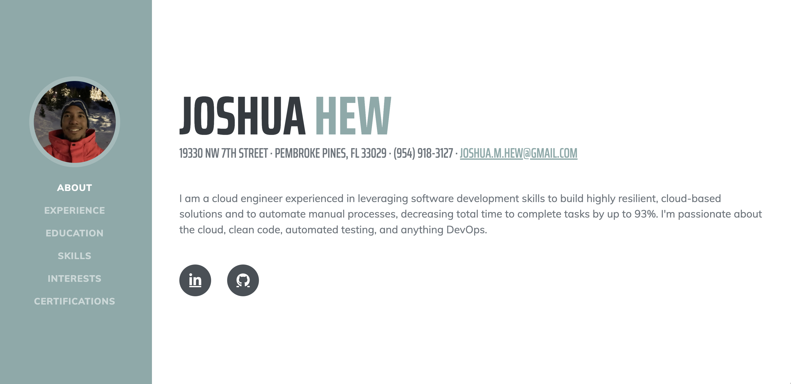

# [My Personal Website](https://joshuahew.me/)

[joshuahew.me](https://joshuahew.me/) was built as a more personal resume / CV and also as a fun side project to test my knowledge of basic website deployments and CI/CD pipelines. Big thanks for [Start Bootstrap](https://startbootstrap.com/) for providing a free and reusable Bootstrap template. 

## Preview

## Tools Used
* AWS S3
* AWS CloudFront
* GitHub Actions

## Status

## Copyright and License

Copyright 2013-2021 Start Bootstrap LLC. Code released under the [MIT](https://github.com/StartBootstrap/startbootstrap-resume/blob/master/LICENSE) license.
